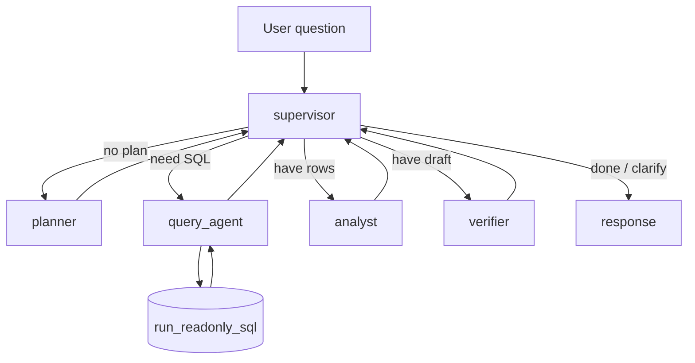

# Dataset Analytics Agent

A **LangGraph multi-agent system** that answers plain-English analytics questions over a SQLite warehouse. The agent plans what to query, generates read-only SQL, drafts a natural-language answer, and **verifies every number is grounded** in query results.

**RelayBoard** is a fictional B2B SaaS product. All warehouse data is **synthetic** and generated locally for demo and eval purposes.

## Why not one LLM call?

Analytical questions over structured data benefit from separation of concerns:

1. **Planning** — which tables, filters, and aggregations apply (no SQL yet)
2. **Deterministic data access** — SQL executed through guardrails, not guessed numbers
3. **Grounded answers** — a verifier checks cited figures against query rows
4. **Supervised routing** — retries and clarification without a fixed pipeline

## Architecture

Supervisor hub pattern: every worker returns to the supervisor until the graph ends.



| Node | LLM? | Role |
|------|------|------|
| **supervisor** | No | Routes workflow; handles empty questions and unactionable plans |
| **planner** | Yes | Structured plan: tables, columns, filters, aggregations |
| **query_agent** | Yes | Writes SQL and runs `run_readonly_sql` |
| **analyst** | Yes | Drafts user-facing answer from query results |
| **verifier** | No | Ensures numbers in the draft appear in SQL output |

### Trust / safety

- **SQL tool:** SELECT-only, forbidden DDL/DML keywords, table allowlist, `PRAGMA query_only`
- **Verifier:** deterministic numeric grounding with tolerance (no LLM critic)
- **Bad input:** empty questions and gibberish plans (empty `tables`) end with a clarification message instead of retrying SQL

## Tech stack

- LangGraph, LangChain, ChatOpenAI (structured output)
- SQLite (local warehouse)
- Pydantic, python-dotenv
- pytest (eval suite)

## Quick start

```bash
python -m venv .venv
source .venv/bin/activate          # Windows: .venv\Scripts\activate
pip install -r requirements.txt
cp .env.example .env               # add OPENAI_API_KEY for full graph evals

python data/generate_db.py         # creates data/relayboard.db
python cli.py ask "What was total active MRR on 2026-03-31?"
pytest eval/evals.py
```

## CLI

```bash
# Ask a question (prints final answer)
python cli.py ask "What was total active MRR on 2026-03-31?"

# Show SQL, query rows, verification, and node trace
python cli.py ask "Which region has the lowest support SLA met rate?" --debug

# Run three sample questions
python cli.py demo
```

Optional: `--thread-id <id>` sets the LangGraph checkpoint thread (reserved for future multiturn work).

### Example

```text
$ python cli.py ask "What was total active MRR on 2026-03-31?"
The total active MRR on March 31, 2026, was $1,022,714.76.
```

With `--debug`, the CLI also prints `sql`, `query_result`, `is_verified`, `node_trace`, and related fields.

## Warehouse

Five tables in `data/schema.sql`:

- `accounts`, `subscriptions`, `usage_daily`, `support_tickets`, `plan_changes`

The generator (`data/generate_db.py`) seeds planted facts for evals (e.g. APAC lowest SLA rate, pro tier highest MRR on 2026-03-31).

## Evals

```bash
pytest eval/evals.py -v
```

| Category | Examples |
|----------|----------|
| SQL guardrails | INSERT rejected, disallowed table rejected |
| Verifier | grounded pass, hallucinated number fail |
| Offline pipeline | analyst cites MRR without API key |
| Full graph (LLM) | active MRR, churn count, APAC SLA, pro tier MRR, gibberish |

**14 tests total.** Without `OPENAI_API_KEY`, deterministic tests pass and LLM/graph tests are skipped. With a key, the full suite runs.

## Scope (v1)

- **In scope:** single-turn analytics Q&A, supervisor orchestration, SQL guardrails, numeric verification, CLI, pytest evals
- **Out of scope (v2):** multiturn conversation, FastAPI server, golden JSON eval runner, LangSmith tracing

## Project layout

```text
cli.py              # Entry point
graph/              # LangGraph builder and routing
nodes/              # planner, query_agent, analyst, verifier, supervisor
tools/sql_tools.py  # Read-only SQL execution
state/              # Shared AnalystState
data/               # schema, DB generator, relayboard.db
eval/evals.py       # Pytest suite
```
